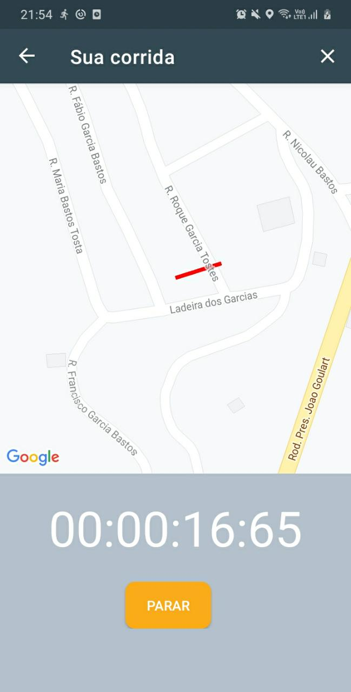
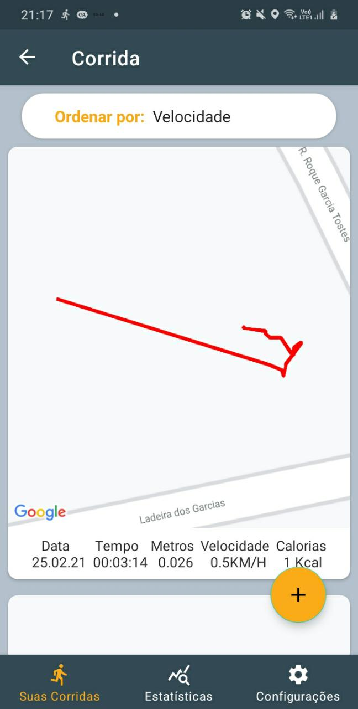
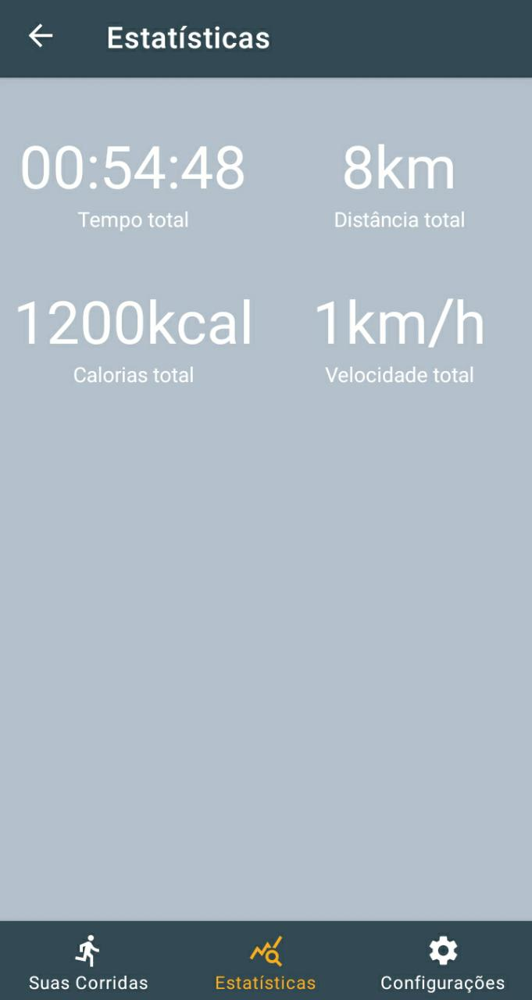

# Sua Corrida

Um aplicativo para rastrear suas corridas.
No processo de desenvolvimento foi ultilizado melhores práticas, como MVVM, navigation componentes, Dagger-Hilt, coroutines, Google Maps SDK, LiveData, services e etc.
A criação deste app teve como finalidade aumentar o portifóli pessoal e conhecimento na área de programação para android.

   

